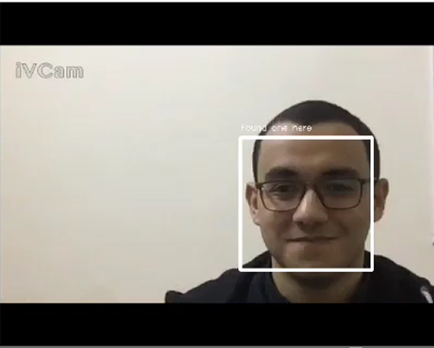

# 1. Haar detection using realtime video capture
 libraries necessary:
 - opencv
This script uses Haar face detection  
https://streamable.com/itmbxn  

P.S:
- an update to this readme will be uploaded in a week isa
